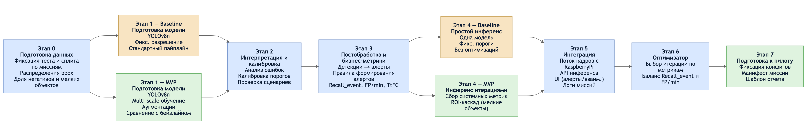
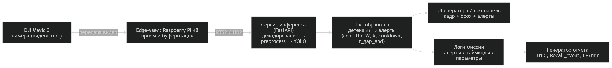
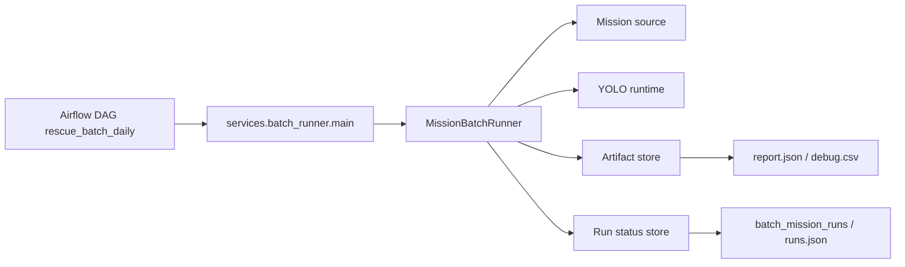

# Rescue-AI

<div align="center">
  <p><strong>MVP-платформа для обнаружения людей на потоке кадров с БПЛА</strong></p>
  <p>FastAPI API + операторский UI + YOLOv8 inference + Postgres/Alembic + batch-контур на Airflow</p>
  <p>
    
    
    
    
    
  </p>
</div>

<p align="center">
  
</p>

## Содержание

- [Rescue-AI](#rescue-ai)
  - [Содержание](#содержание)
  - [О проекте](#о-проекте)
  - [Что уже умеет система](#что-уже-умеет-система)
  - [Архитектура](#архитектура)
    - [Основные контуры](#основные-контуры)
    - [Контракт модели и алертинга](#контракт-модели-и-алертинга)
  - [Быстрый старт через Docker](#быстрый-старт-через-docker)
    - [1. Подготовьте миссию](#1-подготовьте-миссию)
    - [2. Создайте `.env`](#2-создайте-env)
    - [3. Поднимите API и UI](#3-поднимите-api-и-ui)
    - [4. Прогоните миссию через UI](#4-прогоните-миссию-через-ui)
    - [5. Если нужен Postgres backend](#5-если-нужен-postgres-backend)
  - [Хранение артефактов](#хранение-артефактов)
    - [Поведение `ARTIFACTS_*`](#поведение-artifacts_)
  - [Локальный запуск без Docker](#локальный-запуск-без-docker)
  - [Batch / Airflow контур](#batch--airflow-контур)
    - [Структура входных данных для batch](#структура-входных-данных-для-batch)
    - [Быстрый старт batch-платформы](#быстрый-старт-batch-платформы)
    - [Backfill](#backfill)
    - [Поведение batch backend'ов](#поведение-batch-backendов)
    - [Проверка quality gates](#проверка-quality-gates)
  - [Структура проекта](#структура-проекта)
  - [Команды Makefile](#команды-makefile)
  - [Тесты и CI](#тесты-и-ci)
  - [Документация](#документация)

## О проекте

`Rescue-AI` помогает оператору поисково-спасательной миссии не просматривать поток кадров вручную, а получать алерты о вероятном присутствии человека, подтверждать или отклонять их в UI и в конце миссии получать формализованный отчет с метриками качества.

Сейчас в репозитории уже есть два рабочих контура:

- `online/pilot`: FastAPI API, операторский UI, потоковая обработка кадров из локальной папки, алерты и отчет по миссии;
- `batch/mlops`: Airflow DAG для backfill/повторных прогонов, idempotency, хранение статусов и артефактов.

## Что уже умеет система

- Запускает миссию по папке с кадрами и COCO-аннотациями.
- Прогоняет YOLO-модель по каждому кадру и агрегирует детекции в алерты по контракту `configs/nsu_frames_yolov8n_alert_contract.yaml`.
- Показывает операторский UI с текущим алертом, bbox-ами, zoom/pan и действиями `confirm/reject`.
- Считает mission-level метрики: `episodes_total`, `episodes_found`, `recall_event`, `ttfc_sec`, `alerts_total`, `alerts_confirmed`, `alerts_rejected`, `fp_per_minute`.
- Хранит operational state в `memory` или `postgres`, а артефакты отдельно в `local` или `S3`.
- Поддерживает batch backfill через Airflow + DockerOperator с идемпотентным повторным запуском.

## Архитектура

<p align="center">
  
</p>

### Основные контуры

| Контур | Что делает | Ключевые точки входа |
| --- | --- | --- |
| API / Pilot UI | Создает миссию, запускает поток, принимает frame events, выдает алерты и отчет | `services/api_gateway/run.py`, `services/api_gateway/presentation/http/routes.py` |
| Detection service | Собирает stream config, читает кадры, запускает YOLO и публикует detections обратно в API | `services/detection_service/infrastructure/stream_runtime_api.py` |
| Operational storage | Хранит `missions`, `alerts`, `frame_events`, `episodes` в `memory` или `postgres` | `libs/infra/memory`, `libs/infra/postgres`, `db_migrations/` |
| Artifact storage | Сохраняет кадры алертов и `report.json` в `local` или `S3` | `services/api_gateway/infrastructure/artifact_storage.py` |
| Batch platform | Оркестрирует повторяемые запуски через Airflow и batch-runner | `infra/docker-compose.platform.yml`, `services/batch_runner/main.py`, `libs/batch/` |

### Контракт модели и алертинга

- Базовый runtime-контракт лежит в `configs/nsu_frames_yolov8n_alert_contract.yaml`.
- По умолчанию используется `yolov8n_baseline_multiscale`.
- Веса модели лениво скачиваются в `runtime/models/` при первом запуске.

## Быстрый старт через Docker

### 1. Подготовьте миссию

Онлайн-контур ожидает такую структуру данных:

```text
<mission>/
├── images/
│   ├── frame_0001.jpg
│   ├── frame_0002.jpg
│   └── ...
└── annotations/
    └── mission.json
```

Примечания:

- `images/` должен содержать `.jpg`, `.jpeg` или `.png` кадры.
- `annotations/` должен содержать минимум один COCO `.json`.
- В UI нужно будет указывать путь внутри контейнера: `/data/mission/images`.

### 2. Создайте `.env`

```bash
cp .env.example .env
```

Для PowerShell:

```powershell
Copy-Item .env.example .env
```

Минимально заполните:

```env
MISSION_DIR=/absolute/path/to/mission
APP_REPOSITORY_BACKEND=memory
ARTIFACTS_MODE=s3
```

Что важно:

- `MISSION_DIR` монтируется в контейнер как `/data/mission`.
- `runtime/` монтируется в контейнер как `/app/runtime`, поэтому локальные артефакты и кэш модели сохраняются между перезапусками.
- По умолчанию сервис стартует на `http://127.0.0.1:8000`.

### 3. Поднимите API и UI

Режим `memory`:

```bash
docker compose up --build
```

или:

```bash
make up
```

Проверьте health:

```bash
curl http://127.0.0.1:8000/health
```

Ожидаемый ответ:

```json
{"status":"ok"}
```

### 4. Прогоните миссию через UI

1. Откройте `http://127.0.0.1:8000/`.
2. Вставьте путь `/data/mission/images`.
3. Нажмите `Начать миссию`.
4. Подтверждайте или отклоняйте входящие алерты.
5. После завершения нажмите `Закончить миссию`, затем `Отчет по миссии`.

Дополнительно доступны:

- Swagger UI: `http://127.0.0.1:8000/docs`
- Readiness probe: `http://127.0.0.1:8000/ready`
- Version endpoint: `http://127.0.0.1:8000/version`

### 5. Если нужен Postgres backend

В основном `docker-compose.yml` теперь есть опциональный профиль `postgres`.

Дополните `.env`:

```env
APP_REPOSITORY_BACKEND=postgres
APP_POSTGRES_HOST=127.0.0.1
APP_POSTGRES_PORT=5432
APP_POSTGRES_DB=rescue_ai
APP_POSTGRES_USER=rescue_ai
APP_POSTGRES_PASSWORD=change-me
APP_POSTGRES_AUTO_MIGRATE=true
```

Запуск:

```bash
docker compose --profile postgres up --build
```

или:

```bash
make up-postgres
```

При таком старте API-контейнер:

1. ждет доступности Postgres;
2. выполняет `alembic upgrade head`;
3. запускает `uvicorn`.

Если используете `APP_POSTGRES_DSN` внутри Docker-сценария, host в DSN должен быть `postgres`, а не `127.0.0.1`.

Остановка основного контура:

```bash
docker compose down
```

или:

```bash
make down
```

## Хранение артефактов

Артефакты миссии не сохраняются в Postgres. Это отдельный слой хранения:

- кадры алертов;
- `report.json`;
- batch-артефакты вроде `debug.csv`.

### Поведение `ARTIFACTS_*`

| Режим | Что задать | Что произойдет |
| --- | --- | --- |
| `local` | `ARTIFACTS_MODE=local` | Все артефакты пишутся в `ARTIFACTS_LOCAL_ROOT` (`runtime/artifacts` по умолчанию) |
| `s3` без ключей | оставить `ARTIFACTS_MODE=s3`, но не задавать `ARTIFACTS_S3_ACCESS_KEY_ID/SECRET` | Сервис автоматически переключится на локальное хранилище |
| `s3` c полным конфигом | задать все `ARTIFACTS_S3_*` | Отчет и кадры будут сохраняться в S3 |
| `s3` c `ARTIFACTS_S3_STRICT=false` | задать S3 и отключить strict | При ошибках чтения/записи допускается fallback на local |

Обязательные переменные для полноценного S3-режима:

```env
ARTIFACTS_S3_ENDPOINT=...
ARTIFACTS_S3_REGION=...
ARTIFACTS_S3_ACCESS_KEY_ID=...
ARTIFACTS_S3_SECRET_ACCESS_KEY=...
ARTIFACTS_S3_BUCKET=...
ARTIFACTS_S3_STRICT=true
```

Если S3-ключи уже заданы, но не хватает остальных обязательных параметров, сервис завершится с явной ошибкой на старте, а не продолжит работу в полусконфигурированном состоянии.

Практический нюанс: даже в S3-режиме сервис сначала держит локальную копию кадра алерта, чтобы UI мог открыть изображение сразу, пока идет асинхронная загрузка в бакет.

## Локальный запуск без Docker

Если нужен запуск напрямую из Python-окружения:

```bash
uv sync --extra dev --extra batch --extra inference
uv run python -m services.api_gateway.run
```

Что важно:

- `--extra inference` обязателен для реального YOLO runtime;
- `make install` ставит `dev` и `batch` extras, но не `inference`;
- если `APP_REPOSITORY_BACKEND=postgres`, можно отдельно прогнать миграции командой `make db-migrate`.

## Batch / Airflow контур

Batch-платформа поднимается отдельно и предназначена для backfill, nightly/e2e сценариев и воспроизводимых прогонов миссий по датам.



### Структура входных данных для batch

```text
<BATCH_MISSION_ROOT>/
└── <mission_id>/
    └── <ds>/
        ├── images/
        └── annotations/
```

### Быстрый старт batch-платформы

```bash
cp infra/platform.env.example infra/platform.env
docker compose -f infra/docker-compose.platform.yml --env-file infra/platform.env --profile batch-build build batch-runner-image
docker compose -f infra/docker-compose.platform.yml --env-file infra/platform.env up -d
```

Основные UI/endpoint'ы:

- Airflow: `http://localhost:8080`
- Grafana: `http://localhost:3000`
- Prometheus: `http://localhost:9090`

### Backfill

```bash
docker compose -f infra/docker-compose.platform.yml --env-file infra/platform.env exec airflow-webserver \
  airflow dags backfill rescue_batch_daily -s 2026-03-10 -e 2026-03-12
```

### Поведение batch backend'ов

- при `BATCH_RUNTIME_ENV=local` по умолчанию используются `LocalArtifactStore` и `JsonStatusStore`;
- при `shared/stage/prod` по умолчанию используются `S3ArtifactStore` и `PostgresStatusStore`;
- повторный запуск того же `run_key` без `--force` не создает дубликаты: runner возвращает `status=completed` и `report.idempotent_skip=true`.

Остановка batch-платформы:

```bash
docker compose -f infra/docker-compose.platform.yml --env-file infra/platform.env down
```

или:

```bash
make batch-down
```

### Проверка quality gates

```bash
uv run python scripts/batch/check_report_quality.py \
  --report /path/to/report.json \
  --min-recall 0.7 \
  --max-fp-per-minute 5 \
  --max-ttfc-sec 6.5
```

## Структура проекта

```text
.
├── configs/                 # YAML-контракты инференса, алертинга и метрик
├── db_migrations/           # Alembic env + версии миграций Postgres
├── docs/                    # SDD, схемы, ADR, runbook'и, batch-документация
├── infra/                   # Airflow, Prometheus, Grafana, platform compose
├── libs/
│   ├── batch/               # domain/application/infrastructure batch-контура
│   ├── core/                # миссии, алерты, метрики, бизнес-модели
│   └── infra/               # memory/postgres адаптеры и соединения
├── runtime/                 # локальные артефакты и кэш модели
├── scripts/                 # служебные скрипты, в т.ч. quality gate для batch
├── services/
│   ├── api_gateway/         # FastAPI, маршруты, UI и composition root
│   ├── batch_runner/        # CLI entrypoint для batch mission run
│   └── detection_service/   # stream orchestration, frame source, YOLO runtime
├── tests/                   # unit, integration, smoke, architecture tests
├── .github/workflows/       # CI, infra-ci, batch-e2e
├── docker-compose.yml       # основной compose для API и optional Postgres
├── Dockerfile               # образ API / batch-runner
├── Makefile                 # локальные команды разработки
├── pyproject.toml           # зависимости и инструменты
└── config.py                # единая точка доступа к env-переменным
```

## Команды Makefile

| Команда | Что делает |
| --- | --- |
| `make install` | ставит зависимости `dev` + `batch` через `uv sync` |
| `make format` | запускает `black` и `isort` |
| `make lint` | гоняет `black --check`, `isort --check-only`, `flake8`, `mypy`, `pylint` |
| `make test` | запускает весь `pytest` suite |
| `make test-arch` | проверяет import boundaries |
| `make test-batch` | запускает batch smoke/unit suite c coverage gate |
| `make ci` | локальный bundle всех основных проверок |
| `make up` | поднимает API/UI в memory-режиме |
| `make up-postgres` | поднимает API/UI + Postgres |
| `make db-migrate` | применяет Alembic-миграции |
| `make batch-up` | поднимает batch-платформу |
| `make batch-down` | останавливает batch-платформу |
| `make batch-backfill` | запускает demo backfill через Airflow |

## Тесты и CI

В репозитории уже настроены:

- `.github/workflows/ci.yml` — линтеры, типизация, `pytest`, architecture tests, batch smoke tests;
- `.github/workflows/infra-ci.yml` — проверка `infra/docker-compose.platform.yml` и DAG-документации;
- `.github/workflows/batch-e2e.yml` — nightly/manual e2e backfill сценарий для batch-контура.

Локально можно прогнать:

```bash
make ci
```

или адресно:

```bash
make test
make test-arch
make test-batch
```

## Документация

- [ML System Design Doc](docs/ml_system_design_doc.md)
- [Postgres backend runbook](docs/runbooks/postgres_backend.md)
- [Batch operations runbook](docs/runbooks/batch_operations.md)
- [Batch demo playbook](docs/runbooks/batch_demo_playbook.md)
- [Batch evidence pack](docs/batch_evidence_pack.md)
- [Platform / Airflow README](infra/README.md)
- [Batch architecture contour](docs/architecture/batch_contour.md)
- [C4 overview](docs/architecture/c4/c4-overview.md)