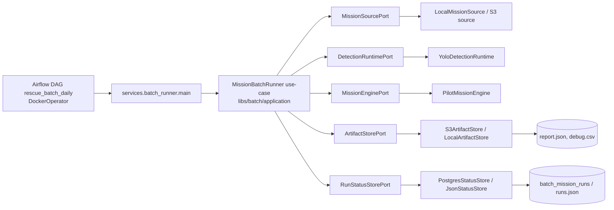

# Batch Architecture Contour

```mermaid
flowchart LR
  A[Airflow DAG rescue_batch_daily\nDockerOperator] --> B[services.batch_runner.main]
  B --> C[MissionBatchRunner use-case\nlibs/batch/application]
  C --> D[MissionSourcePort]
  C --> E[DetectionRuntimePort]
  C --> F[MissionEnginePort]
  C --> G[ArtifactStorePort]
  C --> H[RunStatusStorePort]

  D --> D1[LocalMissionSource / S3 source]
  E --> E1[YoloDetectionRuntime]
  F --> F1[PilotMissionEngine]
  G --> G1[S3ArtifactStore / LocalArtifactStore]
  H --> H1[PostgresStatusStore / JsonStatusStore]

  G1 --> I[(report.json, debug.csv)]
  H1 --> J[(batch_mission_runs / runs.json)]
```

Принцип:
- DAG только оркестрирует запуск.
- Бизнес-логика живет в `MissionBatchRunner`.
- IO и интеграции идут через порты/адаптеры.
