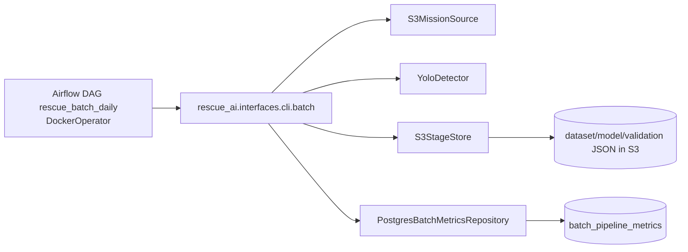

# Batch Architecture Contour

Принцип:
- DAG только оркестрирует запуск.
- Бизнес-логика stage-пайплайна живет в `pipeline_stages`.
- `publish` пишет итоговые метрики напрямую в `batch_pipeline_metrics`.
