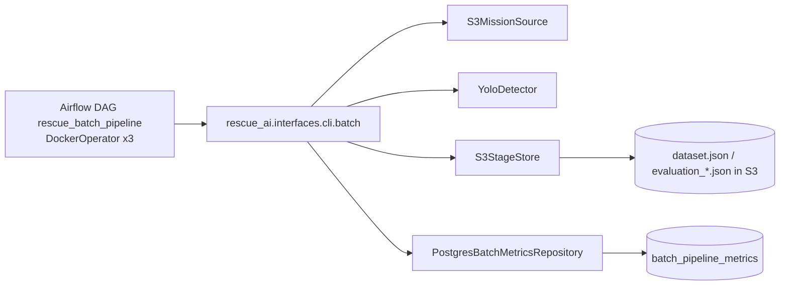

# Batch Architecture Contour

Принцип:
- DAG оркестрирует три таски: `prepare_dataset -> evaluate_model -> publish_metrics`.
- Бизнес-логика стадий живёт в `rescue_ai.application.pipeline_stages`.
- `publish_metrics` апсертит итоговые метрики в `batch_pipeline_metrics`.
