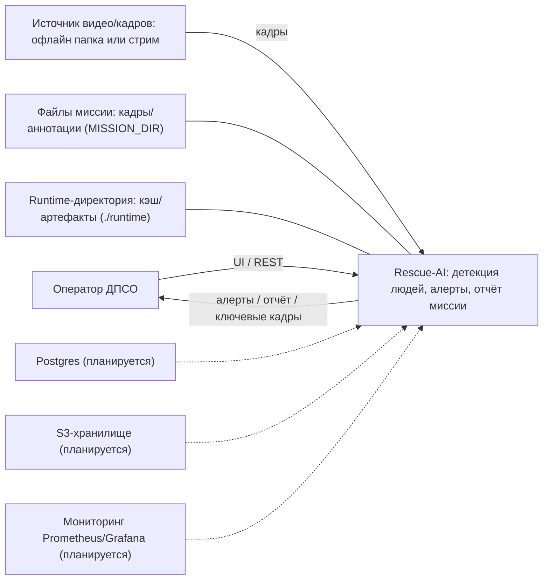

# C4 L1: Контекст системы (System Context)

- Статус: Черновик
- Дата: 2026-03-08
- Автор: Максим Яковенко, Провков Иван, Скрыпник Михаил

## Описание
На уровне L1 показываем систему как “чёрный ящик”: кто с ней взаимодействует и какие внешние зависимости есть у решения.

## Диаграмма (L1)

