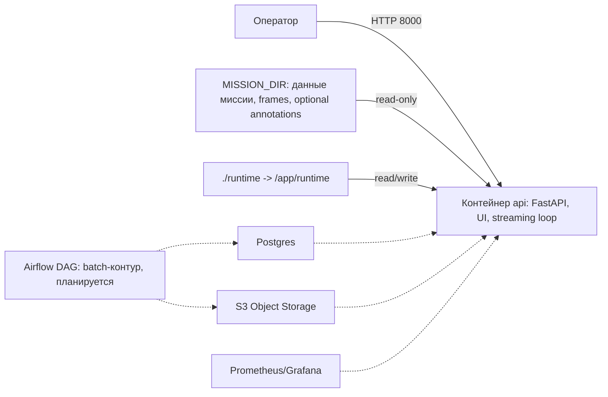

# C4 L2: Контейнеры и внешние зависимости (Container View)

- Статус: Черновик
- Дата: 2026-03-08
- Автор: Максим Яковенко, Провков Иван, Скрыпник Михаил

## Описание
На уровне L2 показываем **разворачиваемые единицы** (контейнеры/сервисы) и внешние системы.
Важно: в текущем MVP **физически разворачивается один контейнер** `api`, внутри которого находятся и HTTP-часть, и streaming-контур.

## Диаграмма (L2)

