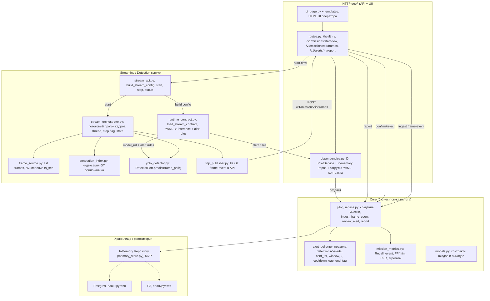

# C4 L3: Компоненты контейнера `api` (FastAPI + streaming loop)

- Статус: Черновик
- Дата: 2026-03-08
- Автор: Максим Яковенко, Провков Иван, Скрыпник Михаил

## Описание
На уровне L3 раскрываем компоненты внутри одного развёртываемого контейнера `api`:
- HTTP-контур (UI + REST)
- Streaming-контур (перебор кадров, инференс)
- Core-контур (алертинг, метрики, отчёт)
- Хранилища (пока in-memory, далее — Postgres/S3)

Ключевая особенность MVP: streaming-контур публикует события кадров через HTTP обратно в тот же сервис
(“loopback”: `HttpFramePublisher -> /v1/missions/{id}/frames`).

## Диаграмма (L3)

