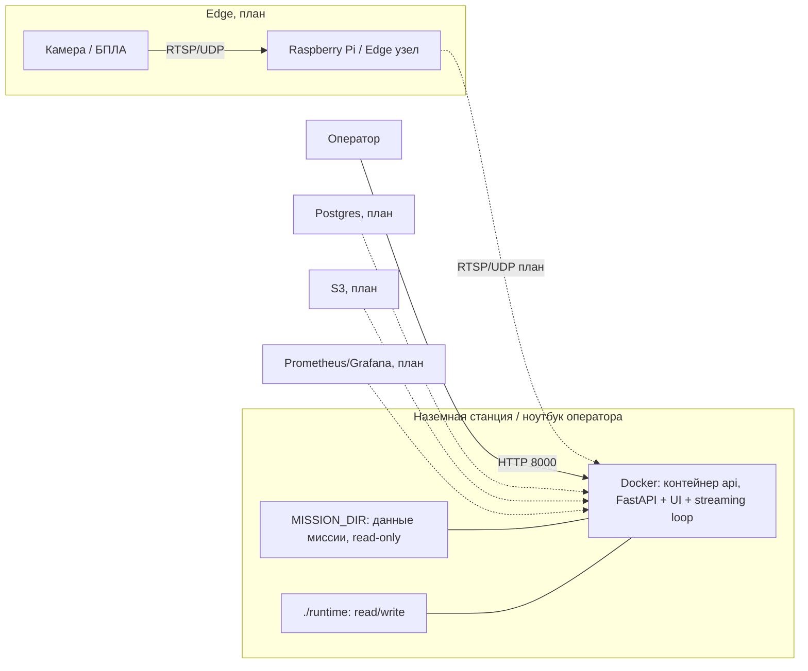

# C4 L4: Развёртывание (Deployment View)

- Статус: Черновик
- Дата: 2026-03-08
- Автор: Максим Яковенко, Провков Иван, Скрыпник Михаил

## Описание
L4 фиксирует, где физически “живут” компоненты в MVP и как это эволюционирует к production.

## Диаграмма (L4)

