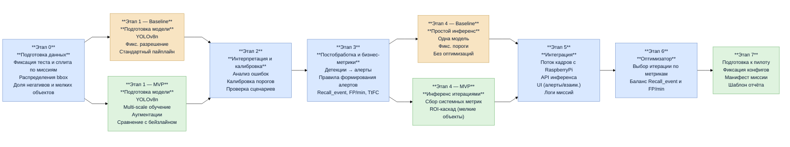

# Дизайн ML системы — Обнаружение людей на потоке с БПЛА (MVP)

## 1. Цели и предпосылки

### 1.1. Зачем идём в разработку продукта?

#### Бизнес-цель
Сократить время обнаружения человека оператором и повысить скорость его реакции при мониторинге видеопотока с БПЛА в ходе поисково-спасательных операций за счёт автоматических подсказок (детекций человека), чтобы оператор реагировал на события, а не выполнял сплошной визуальный поиск по кадрам.

#### Почему станет лучше, чем сейчас, от использования ML
- Вместо механического мониторинга потока внимание оператора освобождается для принятия решения и планирования дальнейших действий.
- Повышается оперативность реакции наземной поисковой группы.
- При том же составе смены возможно обработать больший объём данных или выполнить больше вылетов без резкого роста нагрузки на команду.
- Упрощается отчётность и дальнейший разбор полётов, так как результаты работы системы фиксируются в едином виде.

#### Критерии успеха итерации
##### 1) Ускорение обнаружения (снижение времени до подтверждения цели оператором)

Метрика Time-to-First-Confirm (TtFC) - сколько секунд нужно, чтобы заметить цель, когда она уже присутствует:
```math

TtFC = t_{\text{confirm}} - t_{\text{start}}

```
где:
- `t_confirm` — момент, когда оператор впервые подтверждает, что видит человека;
- `t_start` — момент, когда человек появляется в кадре.

Критерий успеха — относительное улучшение TtFC по сравнению с ручным мониторингом:


```math

\Delta TtFC =

\frac{\text{median}(TtFC_{\text{hand}}) - \text{median}(TtFC_{\text{model}})}

{\text{median}(TtFC_{\text{hand}})}

```

```math
\Delta TtFC \geq 0.25
```
где:

- `TtFC_hand` — TtFC при ручном мониторинге;
- `TtFC_model` — TtFC при использовании ML.

При ручном мониторинге значение `TtFC_hand` = **8,69 секунд**. Таким образом, улучшение считается устойчивым, если на более чем 50% пилотных миссий (оценка проводится на фиксированном наборе из 12 миссий):

```math
\ TtFC_{\text{model}} \leq 6.52 \space с
```

---
##### 2) Полезность подсказок (полнота по эпизодам)

Важно, чтобы система хотя бы раз подсветила человека, когда он реально находится в кадре, чтобы помочь оператору быстро отреагировать. Иначе теряется смысл использования ML во время мониторинга.

Качество метрики оценивается на уровне эпизодов присутствия человека в кадре. 

**Эпизод** — это интервал времени, когда человек реально присутствует в кадре (GT).

Пусть в пилотном наборе есть `K` эпизодов появления человека, и для каждого известен интервал времени:

```math

[s_k, e_k], \quad k = 1,\dots,K

```
где:
- `s_k` — начало эпизода;
- `e_k` — конец эпизода;
- `k` — индекс эпизода.

**Алерт** — это событие, которое генерирует система, чтобы привлечь внимание оператора. Алерт считается по результатам агрегации детекций (bbox + порог уверенности + подтверждение на нескольких кадрах)

Пусть модель выдаёт алерты в моменты времени `t ∈ A`, где `A` — множество временных меток алертов. Эпизод `k` считается найденным, если хотя бы один алерт попал в его интервал (с допуском `τ` секунд):

```math

\text{found}_k =

\begin{cases}

1, & \exists t \in A: \ s_k - \tau \le t \le e_k + \tau \\

0, & \text{иначе}

\end{cases}

```

Критерий успеха — полнота по эпизодам:
```math

Recall_{\text{event}} = \frac{1}{K} \sum_{k=1}^{K} \text{found}_k

```

```math

Recall_{\text{event}} \geq 0.9

```
---
##### 4) Контроль ложных тревог

Система ограничивает количество ложных алертов, чтобы не повышать нагрузку на оператора из-за отвлечения на проверки подозрительных сигналов. Алерт считается ложным, если он не совпал ни с одним GT-эпизодом. Пороговое значение — 1 ложных алерт за 1 минуту миссии:
```math
\ FP/min \leq 1
```

---
### 1.2. Бизнес-требования и ограничения
#### Бизнес-требования
Система должна поддерживать применение БПЛА в поисково-спасательных операциях в режиме мониторинга видеопотока и помогать оператору за счёт автоматических подсказок о вероятном присутствии человека. Результат работы — снижение времени до первого подтверждения цели при сохранении высокой вероятности не пропустить человека.

По функционалу решение предполагает:
- получение видеопотока с БПЛА или видеозаписи миссии;
- формирование подсказок оператору в виде событий/алертов с детекцией человека (класс `Person`) и временными метками;
- минимально достаточную визуализацию для принятия решения (кадр + bbox + таймкод);
- фиксацию показателей в отчёте по миссии (срабатывания, базовые сводные показатели), пригодном для последующего разбора полёта.

#### Бизнес-ограничения
- Подсказки должны приходить достаточно быстро, чтобы их можно было использовать по ходу миссии.
- Количество алертов должно быть ограничено, чтобы оператор мог продолжать управление миссией.
- Пилот предполагает работу без облачной инфраструктуры.
- Эффект должен подтверждаться на нескольких миссиях, а не на одном демонстрационном примере.

#### Что ожидаем от конкретной итерации
MVP для пилота, который можно использовать в операторском контуре без ручной настройки в полевых условиях: единый сценарий запуска, понятный интерфейс отображения подсказок и фиксируемый результат работы в виде отчёта и логов. Система позволяет воспроизводимо провести испытания на нескольких миссиях и собрать данные, достаточные для расчёта метрик из пункта 1.1 и принятия решения о дальнейшем развитии и продуктивизации решения.

#### Описание бизнес-процесса пилота
Пилот проводится на наборе миссий в виде последовательных потоков кадров фиксированной длительности с временными метками и  GT-разметкой присутствия человека. Для обеспечения сопоставимости результатов перед пилотом фиксируются версия модели, параметры инференса и правила формирования алертов:

- порог уверенности детекции `conf_thr = 0.2` 
- размер окна агрегации по времени `W = 1 сек`
- минимальное количество срабатываний в окне `k = 1` 
- минимальный интервал между алертами `cooldown = 1.5 сек` 
- разрыв эпизода `τ_gap_end = 1.2 сек` (если цель пропала дольше, считаем алерт завершенным)

 Каждый алерт имеет временную метку и используется как продуктовая подсказка о вероятном присутствии человека.

Качество пилота оценивается по метрикам, рассчитываемым по результатам прогона каждой миссии и затем агрегируемым по всему набору миссий. Метрика `TtFC` определяется как разница между началом **первого GT-эпизода** появления человека и подтверждением **первого алерта**, который пересёкся с этим эпизодом (с допуском ±τ секунд).

Например, человек присутствует в двух эпизодах (`s - start`, `e - end`, `t - timestamp` считаются относительно начала миссии):

- Эпизод 1: `s1 = 10.0 c`, `e1 = 18.0 c` 
- Эпизод 2: `s2 = 40.0 c`, `e2 = 46.0 c`

Система присылает алерты с метками времени:
- `t = 8.5 c`
- `t = 12.3 c`
- `t = 41.0 c`

Пусть допуск `τ = 1.2 c`. Тогда допустимый интервал для эпизода 1 — `[9.0 c, 19.0 c]`

В этот интервал попал только алерт `12.3 c`, так как  `8.5 c` <  `9.0 c`, а `41.0 c` относится к другому эпизоду. Оператору в среднем нужно `2.5 c` для принятия решения и подтверждения после алерта, тогда:

```math
TtFC = t_{\text{confirm}} - t_{\text{start}} = t - s_{1} + 2.5 = 12.3 - 10.0 + 2.5 = 4.8 \ с
```

То есть система среагировала через 2.3 секунды после начала появления человека в кадре, а общее время до подтверждения составило 4.8 секунды.

Метрика `Recall_event`рассчитывается как доля найденных эпизодов от общего числа эталонных эпизодов по миссии. Для контроля нагрузки фиксируется количество ложных тревог `FP/мин ≤ 1.0`

По завершении пилота система формирует отчёт, включающий: список алертов с временными метками и оценкой корректности относительно эпизодов, рассчитанные значения `TtFC`, `Recall_event` и показателя ложных тревог по каждой миссии, а также сводную агрегацию по всему пилотному набору. Полученные результаты используются для принятия решения о готовности текущей конфигурации алертинга и порогов к дальнейшей итерации или внедрению, а также для выбора направлений улучшений (изменение порога, правил агрегации, дообучение модели на характерных сценариях пропусков/ложных срабатываний).

#### Критерии успеха пилота
```math
\ TtFC_{\text{model}} \leq 6.52 \space с
```
```math

Recall_{\text{event}} \geq 0.9,

```
```math
\ FP/min \leq 1
```

Успешный пилот — это пилот, в котором на >50% миссий (по фиксированному пилотному набору из 12 миссий) есть измеримое улучшение по бизнес-метрикам процесса относительно ручного режима. Улучшение не достигается ценой пропусков цели, а частота ложных тревог остаётся управляемой для оператора. Система работает без критичных задержек и без опоры на облако, формирует понятные отчёты для разбора.

#### Возможные пути развития после пилота
- улучшение качества детекции;
- калибровка режимов чувствительности для разных условий окружающей среды;
- оптимизация под целевое железо (коммерчески доступные одноплатные компьютеры типа RaspberryPi 4B и Orin Nano);
- при возможности — интеграция с внешними системами и датчиками на дроне.

---
### 1.3. Что входит в скоуп проекта/итерации, что не входит

#### На закрытие каких БТ подписываемся в данной итерации
- Детекция класса `Person` на видеопотоке/кадрах с управляемой настройкой порога уверенности и выдачей результата в UI.
- Формирование подсказок в виде алертов с временными метками.
- Воспроизводимая оценка качества и производительности на наборе миссий для принятия решения по следующей итерации.

#### Что не будет закрыто
- интеграция с дополнительными датчиками на борту, в том числе ночной поиск с использованием тепловизионных данных;
- автономное принятие решений уровня полётного контроллера;
- гарантированная точность геопривязки к координатам на карте без внешних источников.

#### Описание результата с точки зрения качества кода и воспроизводимости решения
Воспроизводимое пилотное end-to-end решение в виде репозитория с фиксированными зависимостями, понятными точками запуска и конфигурациями; воспроизводимый пайплайн обучения/оценки и единый формат отчётов; зафиксированные версии датасета/разметки, весов модели и параметров инференса. Воспроизводимость подразумевает, что на одном и том же наборе пилотных миссий при одинаковых конфигурациях получаются сопоставимые метрики эффекта и отчёт пилота, а также сохраняются логи алертов и решений оператора.

#### Описание планируемого технического долга
Полный набор оптимизаций под устройства типа Raspberry Pi и Orin Nano (квантизация, прореживание, оптимизации на уровне рантайма); авторизация и разделение прав на сервисе.

---
### 1.4. Предпосылки решения

Модель работает в режиме обработки видеопотока: горизонт принятия решения — текущий кадр/короткий интервал времени. Продуктовый результат и бизнес-метрики считаются на уровне алертов, потому что именно так измеряется нагрузка на оператора и полезность подсказок в процессе миссии.

- Данные: для обучения и проверки используются размеченные данные, собранные совместно с ДПСО «ЛизаАлерт» в рамках технологических конкурсов (около 60 000 изображений людей в природной среде; различные регионы/сезоны/погода).
- Предполагается, что человек в кадре может быть малым объектом на сложном фоне (лес/поле), возможны частичные перекрытия, различия по высоте полёта, освещению и погоде.
- Предполагается локальный контур обработки без облачной инфраструктуры;
- Стек: дообученный детектор на базе YOLO-подхода с последующей постобработкой (ROI-каскад, трекинг, фильтры временной устойчивости), сервисный слой на FastAPI.

---

## 2. Методология (Data Scientist)

### 2.1. Постановка задачи
С технической точки зрения решается задача **детекции** объекта класса `Person` (человек) на кадрах c дрона (на продуктовом слое кадры агрегируются в алерты)

Основная цель обучения - максимизация полноты (Recall) при контроле ложных тревог (не более 1 за минуту миссии).

---
### 2.2. Блок-схема решения

```mermaid
%%{init: {"flowchart": {"curve": "linear"}, "theme": "base"} }%%
flowchart LR

E0["**Этап 0**<br/>**Подготовка данных**<br/>Фиксация теста и сплита по миссиям<br/>Распределения bbox<br/>Доля негативов и мелких объектов"]
E2["**Этап 2**<br/>**Интерпретация и калибровка**<br/>Анализ ошибок<br/>Калибровка порогов<br/>Проверка сценариев"]
E3["**Этап 3**<br/>**Постобработка и бизнес-метрики**<br/>Детекции → алерты<br/>Правила формирования алертов<br/>Recall_event, FP/min, TtFC"]
E5["**Этап 5**<br/>**Интеграция**<br/>Поток кадров с RaspberryPi<br/>API инференса<br/>UI (алерты/взаим.)<br/>Логи миссий"]
E6["**Этап 6**<br/>**Оптимизатор**<br/>Выбор итерации по метрикам<br/>Баланс Recall_event и FP/min"]
E7["**Этап 7**<br/>Подготовка к пилоту<br/>Фиксация конфигов<br/>Манифест миссии<br/>Шаблон отчёта"]

subgraph S1[" "]
direction TB
B1["**Этап 1 — Baseline**<br/>**Подготовка модели**<br/>YOLOv8n<br/>Фикс. разрешение<br/>Стандартный пайплайн"]
M1["**Этап 1 — MVP**<br/>**Подготовка модели**<br/>YOLOv8n<br/>Multi-scale обучение<br/>Аугментации<br/>Сравнение с бейзлайном"]
end

subgraph S4[" "]
direction TB
B4["**Этап 4 — Baseline**<br/>**Простой инференс**<br/>Одна модель<br/>Фикс. пороги<br/>Без оптимизаций"]
M4["**Этап 4 — MVP**<br/>**Инференс итерациями**<br/>Сбор системных метрик<br/>ROI-каскад (мелкие объекты)"]
end

E0 --> B1
E0 --> M1
B1 --> E2
M1 --> E2

E2 --> E3

E3 --> B4
E3 --> M4
B4 --> E5
M4 --> E5

E5 --> E6 --> E7

classDef stageBlue fill:#D9E8FF,stroke:#6B8CC7,stroke-width:1px,color:#0b1b33;
classDef stageGreen fill:#DFF3DF,stroke:#6FB56F,stroke-width:1px,color:#0b1b33;
classDef stageOrange fill:#F8E4C2,stroke:#C9A35A,stroke-width:1px,color:#0b1b33;

class E0,E2,E3,E5,E6 stageBlue;
class E7,M1,M4 stageGreen;
class B1,B4 stageOrange;

style S1 fill:transparent,stroke:transparent
style S4 fill:transparent,stroke:transparent
```

[**Блок-схема решения в PNG**](./product_schema.png)


### 2.3. Этапы решения задачи (Data Scientist)

#### 2.3.0. Этап 0 — подготовка и проверка данных

| Название данных               | Есть ли данные / источник | Требуемый ресурс | Проверено ли качество |
| ----------------------------- | ------------------------- | ---------------- | --------------------- |
| Кадры                         | ДПСО «ЛизаАлерт»          | DS/ML            | Проверена целостность файлов |
| Аннотации bbox в YOLO-формате | ДПСО «ЛизаАлерт»          | DS/ML            | Проверена корректность аннотаций |

Изображения хранятся как кадры в формате `.JPG` с именованием по шаблону миссии/кадра (например, `01_1_000003.JPG`) и разрешением `3840×2160`.

Результаты автоматических проверок по сплитам:

| Выборка | Всего кадров | Всего bbox | Кадры без bbox | Доля кадров без bbox | bbox с нулевыми размерами | bbox за пределами кадра | bbox с неизвестным классом | Мелких объектов |
| :------ | :----------- | :--------- | :------------- | :------------------- | :------------------------ | :---------------------- | :------------------------- | :-------------- |
| test    | 50538        | 41481      | 20531          | 0.406249             | 0                         | 0                       | 0                          | 21808           |
| train   | 8484         | 6827       | 4398           | 0.518388             | 0                         | 0                       | 0                          | 6807            |
| val     | 1000         | 1763       | 294            | 0.294000             | 0                         | 0                       | 0                          | 1671            |

В исходном датасете тестовая выборка гораздо больше тренировочной и содержит большое количество негативных кадров (без человека), собранных с потока реальной миссии. Эти кадры используются не как стандартный тест для оценки качества модели после обучения, а для проверки устойчивости всего пайплайна и приближенной оценки эксплуатационных метрик, чувствительных к негативам (например, частоты ложных алертов). Для обучения и контроля качества модели выборки формируются как:

- **Train** - 80% от `train+val` (**7588** изображений),
- **Val** - 10% от `train+val` (**948** изображений),
- **Holdout (test)** - 10% от `train+val` (**948** изображений),

при этом кадры и разметка, полученные в рамках одной миссии, находятся строго внутри одного сплита, чтобы избежать утечки соседних кадров, поэтому возможно изменение соотношений по сплитам на 2-3%.

| Часть данных                    | Что нужно проверить                                                                                                          |
| ------------------------------- | ---------------------------------------------------------------------------------------------------------------------------- |
| **Кадры без bbox** (негативные) | Доля негативов в `Val` не отличается существенно от ожидаемого рабочего потока                                               |
| **Кадры с bbox** (позитивные)   | Распределение плотности людей на кадрах в `Val` отражает распределение в `Train/Holdout/test`                                |
|                                 | Распределение размеров bbox в `Val` сопоставимо с `Train/Holdout/test`                                                       |
|                                 | Нет выраженного смещения положения объектов к центру или к краям кадров                                                      |
|                                 | Распределение соотношения сторон bbox в `Val` сопоставимо с `Train/Holdout/test` (нет аномально вытянутых разметок/выбросов) |
|                                 | Доля мелких объектов (<0.1% кадра) требует заложения отдельной стратегии обучения (SAHI, ROI-каскад, мульти-скейл)           |

**Таргет:** bbox человека в формате YOLO:

```math
\langle class\_id, x, y, w, h\rangle
```

где `x,y` — центр bbox, `w,h` — ширина/высота; все величины нормированы в долях ширины/высоты изображения.

#### 2.3.1. Этап 1 — подготовка моделей детекции

| Компонент         | Baseline                                       | MVP                                                                              |
| ----------------- | ---------------------------------------------- | -------------------------------------------------------------------------------- |
| Архитектура       | YOLOv8n (детектор `Person, class 0`)           | YOLOv8n (детектор `Person, class 0`)                                             |
| Разрешение        | 640×640                                        | Multi-scale 640-1280                                                             |
| Пайплайн обучения | Стандартный набор аугментаций flip/scale/color | Подбор аугментаций под миссии, акцент на мелких объектах (P2(4) в голове модели) |
| Выход этапа       | Baseline-веса и протокол обучения              | Лучшая MVP-итерация обучения и сравнительная таблица метрик                      |

Сравниваем Baseline и MVP по метрикам:
- `mAP50`,
- `mAP50-95`,
- `Precision`,
- `Recall`,
- `F1`

**Гранулярность и горизонт:** На ML‑уровне модель решает задачу детекции на кадре (выдает bbox и score); на продуктовом уровне качество оценивается через события (алерты) в ходе миссии, итоговые метрики TtFC, Recall_event, FP/min считаются по миссии.

**Риски:** Рост FP на при попытке повысить recall на микро‑целях (снижается последующей калибровкой постобработки)

#### 2.3.2. Этап 2 — интерпретация результатов и калибровка порогов

На этом этапе проводится ошибка‑анализ на уровне миссий и калибровка параметров инференса (confidence, NMS), чтобы поведение детектора соответствовало продуктовым ограничениям по ложным тревогам и обеспечивало устойчивый `Recall_event`.

| Компонент     | Baseline                                     | MVP                                                                               |
| ------------- | -------------------------------------------- | --------------------------------------------------------------------------------- |
| Анализ ошибок | Быстрый просмотр типовых FP/FN               | Анализ по миссиям и срезам условий (высота, размер объекта, пересвет, перекрытия) |
| Калибровка    | Стандартные пороги для стабильного инференса | Калибровка порогов под целевые бизнес-метрики  (`FP/min`, `Recall_event`)         |
| Выход этапа   | Фиксированные Baseline-пороги                | Откалиброванные пороги/режимы и перечень типовых ошибок с причинами               |

#### 2.3.3. Этап 3 — бизнес-правила формирования алертов и расчёт бизнес-метрик

Поскольку продуктовой единицей является **алерт**, вводим слой бизнес‑правил, преобразующий детекции в события. На этом слое рассчитываем целевые метрики `TtFC`, `Recall_event`, `FP/min`, фиксируем параметры постобработки для пилотной итерации MVP:

- порог уверенности детекции `conf_thr = 0.2` 
- размер окна агрегации по времени `W = 1 сек`
- минимальное количество срабатываний в окне `k = 1` 
- минимальный интервал между алертами `cooldown = 1.5 сек` 
- разрыв эпизода `τ_gap_end = 1.2 сек` (если цель пропала дольше, считаем алерт завершенным)

**Метрика ложных тревог:**

```math

FP/\min = \frac{N_{\text{false alerts}}}{T_{\text{mission}}/60}

```

где `N_false alerts` — число алертов вне GT‑эпизодов (с учётом допуска), `T_mission` — длительность миссии в секундах.

| Компонент         | Baseline                               | MVP                                                            |
| ----------------- | -------------------------------------- | -------------------------------------------------------------- |
| Правила алертинга | 1 детекция с `conf_thr > 0.2`= 1 алерт | Контракт пилота: `conf_thr`, `W`, `k`, `cooldown`, `τ_gap_end` |
| Метрики           | `Recall_event`, `FP/min`, `TtFC`       | `Recall_event`, `FP/min`, `TtFC`                               |
| Выход этапа       | Baseline-конфиг алертинга              | MVP-конфиг алертинга                                           |

**Риски:** Слишком жёсткие правила уменьшают `Recall_event`, слишком мягкие повышают `FP/min` - компромисс выбираем на этапе 6 (оптимизатор)

#### 2.3.4. Этап 4 — подготовка инференса по итерациям

На данном этапе готовим практический режим инференса и замеряем системные характеристики, необходимые для пилота:
- `p50/p95 latency`,
- `FPS`,
- `Inference Time`

| Компонент   | Baseline                              | MVP                                                        |
| ----------- | ------------------------------------- | ---------------------------------------------------------- |
| Инференс    | Одна модель с фиксированными порогами | Итерации инференса с разными конфигами                     |
| Улучшения   | Без оптимизаций                       | ROI-каскад для мелких объектов при необходимости           |
| Выход этапа | Baseline-режим инференса              | Набор итераций с измерениями качества и производительности |

#### 2.3.5. Этап 5 — интеграция источника потока кадров и интерфейса

На этом этапе собираем end-to-end контур «поток кадров - инференс - логирование - отчет по миссии»

| Компонент       | Baseline                                     | MVP                                                             |
| --------------- | -------------------------------------------- | --------------------------------------------------------------- |
| Источник данных | Поток в офлайне для воспроизводимых прогонов | Поток кадров с RaspberryPi 4B                                   |
| Интеграция      | Вывод bbox/алертов                           | API инференса + пользовательский интерфейс и логирование миссий |
| Выход этапа     | Рабочий прототип контура                     | Пилотный контур с логами и артефактами для расчета метрик       |

#### 2.3.6. Этап 6 — выбор оптимальной итерации

Выбираем конфигурацию, которая обеспечивает максимальную полезность алертов при соблюдении ограничений на ложные тревоги. Формально критерий отбора записывается как:

```math
i^*=\arg\max_i ; Recall_{event}^{(i)}  
\quad \text{при условиях} \quad  
Recall_{event}^{(i)} \ge 0.9,;  
FP/\min^{(i)} \le 1
```
где `i` — индекс итерации (модель + параметры инференса + постобработка)

Если две конфигурации имеют одинаковое значение Recall_event, выбираем версию с меньшей p95-latency, чтобы система была более отзывчивой в пилоте.

| Компонент    | Baseline                            | MVP                                                 |
| ------------ | ----------------------------------- | --------------------------------------------------- |
| Выбор версии | Вручную по таблице метрик           | Формальный критерий отбора и контрольные миссии     |
| Выход этапа  | Baseline-конфигурация нулевой точки | Выбранная конфигурация для пилота и протокол выбора |

**Риски:** ни одна из версий не достигнет целевого значения Recall_event. В этом случае выбираем лучшую по recall при FP/min ≤ 1 и фиксируем разницу до цели 0.9 как план работ, либо временно ослабляем порог 0.9 для MVP, но обязуемся закрыть в следующей итерации.

#### 2.3.7. Этап 7 — подготовка финального отчёта и артефактов

На этом этапе формируем пакет артефактов, обеспечивающий воспроизводимый запуск пилотной проверки и сопоставимость результатов между итерациями:

- зафиксированная версия модели и параметры инференса, 
- конфигурация постобработки (правила формирования алертов),
- манифест набора миссий (список фрагментов, длительность, пути),
- шаблон отчёта по миссии и агрегирующего отчёта по набору миссий в едином формате со структурой полей:
	- список алертов с временными метками и разметкой TP/FP относительно GT-эпизодов,
    - `TtFC`, `Recall_event`, `FP/min` по миссии,
    - агрегация метрик по набору миссий

**Выход этапа:** Версионированный пакет, который далее используется для проведения пилота, и возможные рекомендации по улучшению.

---

## 3. Подготовка пилота

### 3.1. Способ оценки пилота

Проводим пилот на наборе из 12 миссий, представленных как последовательности кадров фиксированной длительности с временными метками и GT-разметкой эпизодов присутствия человека. Перед запуском пилота фиксируем версию модели, параметры инференса и правила формирования алертов:

- `conf_thr = 0.2`,
- `W = 1 сек`,
- `k = 1`,
- `cooldown = 1.5 сек`,
- `τ_gap_end = 1.2 сек`.

Единицей продуктовой оценки является **алерт** — событие с временной меткой, получаемое агрегацией детекций по времени. Качество пилота оцениваем по метрикам каждой миссии, затем агрегируемым по всему пилотному набору.

Метрика **TtFC** в пилоте — разница между началом **первого GT-эпизода** появления человека и моментом подтверждения **первого алерта**, который пересёкся с этим эпизодом (с допуском `±τ`). Подтверждение после алерта моделируется фиксированным временем принятия решения оператором `2.5 c`, поэтому:

```math
TtFC = t - s_1 + 2.5 \text{ c}
```

где:
- `s_1` — начало первого GT-эпизода,
- `t` — временная метка первого алерта, попавшего в первый GT-эпизод с допуском `±τ`.

### 3.2. Что считаем успешным пилотом

Пилот считается успешным, если одновременно выполняются условия:

1. **Ускорение обнаружения (TtFC)**  
   Относительное улучшение медианного времени на 25%:

```math
\Delta TtFC \geq 0.25
```

Численно порог для устойчивого улучшения (на более чем 50% миссий пилота; проверка на фиксированном наборе из 12 миссий) равен:

```math
TtFC_{\text{model}} \leq 6.52 \text{ c}
```

2. **Полезность подсказок на уровне эпизодов (Recall_event)**  
   Эпизод `k` считается найденным, если хотя бы один алерт попал в его интервал (с допуском `τ` секунд), и:

```math
Recall_{\text{event}} = \frac{1}{K} \sum_{k=1}^{K} \text{found}_k \geq 0.9
```

3. **Контроль ложных тревог (FP/min)**  
   Частота ложных алертов не должна превышать `1` в минуту:

```math
FP/\min \leq 1
```

Таким образом, успешный пилот — это пилот, в котором более чем на 50% миссий (по фиксированному набору из 12 миссий) достигается измеримое улучшение по метрике TtFC при одновременном выполнении ограничений по метрикам Recall_event и FP/min, без критичных задержек и без опоры на облачную инфраструктуру.

### 3.3. Подготовка пилота

**1) Фиксируем артефакты и конфиги пилота**  
До запуска фиксируются:
- веса модели (точная версия/хэш артефакта);
- параметры инференса и NMS;
- контракт алертинга (`conf_thr`, `W`, `k`, `cooldown`, `τ_gap_end`) и допуск `τ = 1.2 c` для пересечения с GT-эпизодами;
- манифест пилотных миссий (список фрагментов, длительность, пути);
- единый формат логов и отчётов.

**2) Перепроверяем вычислительную применимость выбранного конфига**  
Перед запуском пилота выбранная на Этапе 6 конфигурация должна удовлетворять ограничениям по производительности, измеренным на Этапе 4 (`p50/p95 latency`, `FPS`, `Inference Time`). Если конфигурация не обеспечивает стабильную обработку потока без критичных задержек, пилот считается некорректным (результаты неинтерпретируемы), и нужен возврат к выбору другой итерации/упрощению пайплайна.

**3) Фиксируем правило применения контракта**  
В ходе пилота запрещены изменения конфигурации, влияющие на формирование алертов и расчёт метрик. Зафиксированный в п. 3.3 (п. 1) контракт алертинга и выбранная на Этапе 6 конфигурация применяются неизменно ко всем миссиям пилотного набора. Любое изменение конфигурации допускается только вне пилота и оформляется как новая версия с отдельным прогоном и отчётом.

**4) Готовим отчёт по пилоту**  
По завершении прогона система формирует отчёт по каждой миссии и сводную агрегацию по пилотному набору (12 миссий): список алертов с временными метками и классификацией TP/FP относительно GT-эпизодов, значения `TtFC`, `Recall_event`, `FP/min` и агрегаты по всему набору миссий. Эти результаты используются для решения о готовности конфигурации и выборе направлений улучшений (порог, правила агрегации, дообучение по типовым FP/FN).

## 4. Внедрение

### 4.1. Архитектура решения

Целевая архитектура решения согласована с текущим MVP и вынесена в отдельный артефакт.

**Architecture schema:** [Открыть architecture schema](./architecture_schema.png)

---

### 4.2. Описание инфраструктуры

- Edge-узел (Raspberry Pi 4B) принимает поток и передаёт его в сервис (RTSP/UDP-протокол). На БПЛА используется связка с ArduPilot через MAVLink.
- На наземной станции запускаются `api_gateway`, `detection_service`, `flight_adapter`, UI оператора и вспомогательные фоновые компоненты. Развёртывание выполняется локально, без Kubernetes.
- В MVP используется один активный сервис инференса; отказоустойчивость обеспечивается health-check’ами, автоперезапуском, журналом миссии и локальным кэшем модели.
- После приёма кадры помещаются в ограниченный локальный буфер, который сглаживает кратковременные пики нагрузки и не допускает бесконечного роста задержки.
- Рабочая версия модели предварительно загружается из S3-compatible storage и хранится локально на наземной станции; во время активной миссии сервис инференса использует локальную копию модели.
- Данные пилота и другие артефакты выносятся во внешнее хранилище: файловое (S3-подобное) и БД для метаданных (PostgreSQL).

---

### 4.3. Требования к системе

Во время поиска система должна либо продолжать выдавать оператору подсказки, либо перейти в явно обозначенный деградированный или аварийный режим, сохранить состояние миссии и инициировать безопасное завершение полёта.

В production-интеграции система работает в связке **ArduPilot + companion computer (RaspberryPi/Orin) + MAVLink**:
- companion computer получает по MAVLink телеметрию и статусы автопилота;
- ML-сервис использует их только для логики миссии (приём потока, инференс, постобработку, алерты, журнал миссии и восстановление после сбоев вычислительной части) и может отправлять лишь высокоуровневые команды безопасного режима: `RTL` или `Land`, через отдельный `flight_adapter`;
- само исполнение аварийного манёвра выполняет автопилот: в ArduPilot GCS failsafe отслеживает время с последнего MAVLink heartbeat и по параметрам может выполнять `Land`, `RTL` или `SmartRTL`.

#### 4.3.1. Механизмы обеспечения отказоустойчивости

| Механизм | Реализация | Эффект |
| --- | --- | --- |
| **Разделение критического и фоновых сервисов** | В критический контур миссии входят приём потока, сервис инференса, постобработка алертов, `flight_adapter` и UI оператора. PostgreSQL, выгрузка артефактов в S3-compatible storage и генерация итогового отчёта работают как фоновые компоненты и не блокируют online-обработку. Сервисы запускаются на наземной станции как отдельные локальные процессы или контейнеры. | Отказ БД, S3 или сервиса отчётов не останавливает миссию и не прекращает выдачу алертов оператору. |
| **Журнал миссии** | Для каждого кадра и события фиксируются `mission_id`, `frame_id`, `timestamp`, статус обработки, версия модели и текущий статус миссии. После рестарта сервисы читают последнее подтверждённое состояние из журнала и продолжают работу с него. | При падении сервиса миссия не начинается заново и не теряет уже обработанные данные. |
| **Ограниченный локальный буфер кадров** | После приёма кадры помещаются в ограниченный локальный буфер на наземной станции. Буфер нужен только для сглаживания кратковременных скачков нагрузки и не накапливает поток бесконечно. При переполнении старые кадры отбрасываются по заданному правилу, а система переходит в деградированный режим. | Кратковременные просадки производительности не приводят к мгновенному срыву миссии и не вызывают неконтролируемого роста задержки. |
| **SAFE_MODE при перегрузке** | Если растут задержка обработки, заполнение буфера или нагрузка на CPU/RAM, система переводит миссию в `SAFE_MODE`: снижает частоту обработки кадров, уменьшает разрешение инференса и ограничивает накопление новых кадров. | Система продолжает работать в упрощённом, но управляемом режиме вместо полного отказа. |
| **Проверка живости сервисов** | Для сервисов приёма потока, инференса, постобработки и UI задаются health-check’и: отвечает ли процесс, готов ли он принимать нагрузку, появляются ли новые результаты. | Система понимает, что сервис реально работает или уже вышел из строя. |
| **Контроль фактической активности компонентов** | Помимо проверки “жив ли процесс”, контролируются признаки реальной работы: `no_frame_duration`, `no_inference_result_duration`, `telemetry_gap_sec`, а также задержка обработки и частота алертов. Это позволяет обнаруживать не только падение процесса, но и зависание, при котором процесс формально жив, но фактически не выполняет свою функцию. | Ловятся скрытые зависания, которые не видны по обычной проверке статуса процесса. |
| **Автоперезапуск сервисов** | Сервисы запускаются под локальным супервизором процессов или в контейнерах с политикой автоматического перезапуска. При сбое сервис автоматически поднимается заново, проходит проверку готовности и возвращается в работу без ручного вмешательства оператора. | Кратковременные программные сбои устраняются автоматически. |
| **Один активный сервис инференса** | В MVP используется один активный сервис инференса на наземной станции. Отказоустойчивость обеспечивается не резервным экземпляром, а контролем состояния процесса, автоматическим рестартом, журналом миссии и локальным кэшем модели. При сбое сервис перезапускается, повторно инициализирует модель и продолжает обработку потока. | Архитектура остаётся реалистичной для MVP и production-first контура без лишнего усложнения. |
| **Локальный кэш модели** | Актуальная рабочая модель заранее загружается из S3-compatible storage в локальный каталог на наземной станции и используется оттуда во время активной миссии. При рестарте сервис инференса поднимается на локальной копии модели. | Отказ внешнего хранилища во время миссии не останавливает инференс, если локальная копия уже есть. |
| **Fallback на последнюю валидную модель** | Если новая модель не загружается, повреждена или не проходит проверку целостности, сервис инференса переключается на последнюю валидированную локальную версию и фиксирует событие `MODEL_FALLBACK`. | Миссия продолжается даже при проблеме с новым артефактом модели. |
| **Локальное сохранение данных при отказе внешних хранилищ** | Если PostgreSQL или S3 недоступны, метаданные, ключевые кадры и события миссии временно сохраняются локально и помечаются как ожидающие синхронизации после восстановления внешней инфраструктуры. | Миссия продолжается даже при отказе внешних хранилищ. |
| **Идемпотентная запись результатов** | Для записей по кадрам и алертам используются уникальные идентификаторы (`mission_id`, `frame_id`, `alert_id`). Повторная обработка после рестарта не создаёт дубликаты, а обновляет уже существующую запись. | После рестартов и повторной обработки система не дублирует события. |
| **Независимый контур flight safety** | На борту работает `flight_adapter`, который получает телеметрию от **ArduPilot** по **MAVLink** через companion computer и может отправлять только высокоуровневые команды `RTL` / `Land`. Критическая логика безопасного завершения полёта не зависит от состояния ML-сервиса, UI или внешних хранилищ. | Критические полётные сценарии не зависят от отказов вычислительной части. |
| **Преднастроенные failsafe-сценарии на борту** | В **ArduPilot** заранее настраиваются `GCS failsafe`, `Battery failsafe`, профиль `RTL` и допустимые сценарии `Land` / `SmartRTL`. | Даже если наземный сервис детекции недоступен, БПЛА всё равно может завершить полёт по безопасному сценарию. |
| **Явные статусы деградации и аварии** | Миссия всегда находится в одном из понятных состояний: `RUNNING`, `DEGRADED`, `SAFE_MODE`, `LINK_LOSS`, `BATTERY_ABORT`, `EMERGENCY_TERMINATE`, `MODEL_FALLBACK`. | Оператор видит, что именно произошло и в каком режиме сейчас работает система. |

#### 4.3.2. Сценарии отказов и действия системы

| Сценарий | Как обнаруживаем | Что делает ML-система | Что делает автопилот | Результат |
| --- | --- | --- | --- | --- |
| **Погодные условия вышли за допустимые**: сильный ветер, дождь, снег, туман, резкое ухудшение видимости | статусы автопилота, резкое ухудшение наблюдаемости и качества потока | переводит миссию в `WEATHER_ABORT`, завершает обработку уже принятых кадров, сохраняет журнал миссии и передаёт команду на безопасное завершение полёта | при наличии связи выполняет заранее выбранный сценарий: `RTL` или `Land` | миссия завершается контролируемо, данные не теряются |
| **Потеря связи с дроном (lost link)** | нет heartbeat/телеметрии от БПЛА дольше 5 секунд | фиксирует `LINK_LOSS`, сохраняет последнее известное состояние миссии, замораживает основной рабочий контур и перестаёт ожидать новые кадры | сам запускает преднастроенный lost-link failsafe | если связь восстановилась — миссия может продолжиться; если нет — БПЛА завершает полёт по failsafe |
| **Критический отказ БПЛА**: аппарат сбит, разрушен, физически потерян | резкий обрыв потока и телеметрии, отсутствие ответа flight controller | переводит миссию в `EMERGENCY_TERMINATE`, закрывает буфер обработки, сохраняет последний кадр, последнюю телеметрию, версию модели и журнал алертов | дополнительного действия уже нет: аппарат считается потерянным или аварийно завершившим полёт | миссия аварийно завершена, система сохраняет данные для разбора инцидента |
| **Критически низкий заряд батареи** | warning/critical battery от автопилота | переводит миссию в `BATTERY_ABORT`, прекращает выдачу новых поисковых задач, сохраняет состояние миссии, инициирует безопасное завершение миссии | выполняет low-battery failsafe: `RTL` или `Land` | поиск прекращается безопасно, снижается риск потери БПЛА |
| **Сервис инференса упал или завис** | 3 подряд неуспешных health-check, нет новых результатов инференса, либо превышен допустимый `no_inference_result_duration` | Система переводит миссию в `DEGRADED`, временно перестаёт подавать новые кадры в инференс, сохраняет текущее состояние в журнал миссии и автоматически перезапускает сервис инференса. После рестарта сервис повторно загружает локальную копию рабочей модели, проходит warm-up и продолжает обработку потока с последнего подтверждённого состояния. При необходимости на время восстановления включается `SAFE_MODE` с пониженной частотой обработки. | не участвует | миссия продолжается после короткой паузы без ручного переключения на резервный инференс |
| **Поток с БПЛА пропал или RTSP/UDP-сессия зависла** | `no_frame_duration > 2 c` или повторяются одинаковые кадры/таймкоды | watchdog переводит поток в `DEGRADED`, выполняет реконнект с бэкоффом `0.5 c, 1 c, 2 c, 4 c, 8 c`, при необходимости перезапускает приёмник и декодер | не участвует, пока связь с БПЛА не потеряна полностью | при восстановлении потока миссия продолжается без ручного рестарта |
| **Пайплайн перегружен**: растёт локальный буфер, latency выходит за допустимый предел | рост длины буфера, `latency_p95`, перегрузка CPU/RAM | включается `SAFE_MODE`: снижается частота обработки, уменьшается разрешение инференса, старые кадры сверх лимита отбрасываются | не участвует | миссия продолжается в деградированном режиме вместо полного отказа |
| **Постобработка детекций в алерты упала** | детекции есть, новых алертов нет | сервис постобработки перезапускается; пропущенный участок пересчитывается по журналу детекций | не участвует | обнаружения не теряются, возможна только задержка алертов |
| **Модель не загрузилась / артефакт повреждён** | ошибка инициализации, несовпадение контрольной суммы файла | сервис переключается на последнюю валидированную локальную модель, фиксирует `MODEL_FALLBACK` и продолжает работу | не участвует | миссия продолжается с возможной деградацией качества, но без полной остановки |
| **Внешнее хранилище недоступно** | ошибки записи, таймауты upload/save | события, ключевые кадры и отчёты временно сохраняются локально и помечаются для последующей синхронизации | не участвует | live-path не прерывается, откладывается только выгрузка артефактов |
| **UI оператора недоступен** | нет ответа UI / потеря web-session | UI перезапускается, состояние миссии восстанавливается из кэша/журнала, инференс продолжает работу независимо | не участвует | вычислительный контур не останавливается из-за фронтенда |
| **Шторм ложных алертов** в сложных условиях поиска | резко растёт `alerts_per_min`, оператор массово отклоняет алерты | включается строгий профиль алертинга: повышаются требования к устойчивости события, увеличивается `cooldown` | не участвует | миссия продолжается с меньшим числом ложных тревог |
| **Недостаточно места на диске НСУ** | `disk_free < threshold` | удаляются временные файлы, отключаются debug-артефакты, сохраняются только обязательные логи и ключевые кадры | не участвует | миссия продолжается в режиме ограниченного хранения |
| **Сбой генерации отчёта после миссии** | ошибка агрегации логов или export-service | сервис отчёта перезапускается, отчёт пересобирается по журналу миссии | не участвует | на live-path не влияет |                                                              

#### 4.3.3. Безопасное завершение миссии

1. **ML-контур обнаруживает критическое состояние**: lost link, low battery, weather abort, разрушение цепочки наблюдаемости, критический отказ БПЛА.
2. **Миссия переводится в аварийный статус**: `BATTERY_ABORT`, `WEATHER_ABORT_REQUESTED`, `LINK_LOSS`, `EMERGENCY_TERMINATE`.
3. **Фиксируется аварийный снимок состояния**: последний валидный кадр, последние алерты, последняя телеметрия, версия модели, версия конфига, таймкод последнего контакта.
4. Если связь с автопилотом ещё есть, `flight_adapter` **отправляет высокоуровневую команду** безопасного режима на один из заранее определённых сценариев:
   - `Return-to-Launch (RTL)` — если связь/навигация позволяют безопасно вернуться;
   - `Hover-and-Wait` — если ожидается кратковременное восстановление связи и зависание безопасно;
   - `Land` — если дальнейший контролируемый полёт невозможен.
5. Если связи уже нет, дальше работает только преднастроенный failsafe автопилота.
6. **После завершения полёта** состояние миссии блокируется для модификации.

#### 4.3.4. Наблюдаемость и эксплуатационные сигналы

Для MVP и первой production-версии наблюдаемость строится без отдельной платформы оркестрации: через health-check эндпоинты, структурированные логи, watchdog и периодические снимки состояния миссии.

- **Поток и связь:** `frames_received_total`, `frames_dropped_total`, `no_frame_duration`, `stream_freeze_events_total`, время с последнего heartbeat от БПЛА.
- **Инференс:** `inference_errors_total`, `health_failures_total`, `service_restarts_total`, `model_fallback_events_total`.
- **Производительность:** длина локального буфера, `latency_p50`, `latency_p95`, `fps_infer`, число включений `SAFE_MODE`.
- **Алертинг:** `alerts_total`, `alerts_per_min`, доля подтверждённых и отклонённых алертов, число включений строгого профиля.
- **Хранилища:** число невыгруженных артефактов, размер локального spool-каталога, время последней успешной синхронизации.
- **Системные ресурсы:** CPU, RAM, disk free, число рестартов сервисов.
- **Полётная безопасность:** lost-link events, battery warnings, emergency events, тип активированного failsafe-сценария.


---

### 4.4. Безопасность системы

Система предполагает работу в локальном контуре без публичного доступа в интернет. Основные угрозы: ошибочная конфигурация сети, несанкционированный доступ из той же локальной сети (случайный/вредоносный), подмена источника потока, а также эксплуатационные ошибки (неправильные токены/пароли, открытые порты).

**Меры защиты:**
- **Сетевой периметр:** сервисы (UI/API) доступны только в локальной сети НСУ/оператора; отсутствует проброс наружу; закрытие неиспользуемых портов (firewall).
- **Ограничение источника видеопотока:** белый список IP/портов источника (Raspberry Pi) + при возможности базовая аутентификация для RTSP.
- **Доступ к UI/API:** минимальная аутентификация (basic auth/токен), чтобы исключить случайный доступ в локальной сети.
- **Журналирование:** логирование попыток подключения к UI/API и ошибок приема потока (для расследования “почему пропал поток/почему странные данные”).
- **Принцип наименьших привилегий:** сервисы запускаются от отдельного пользователя, с минимальными правами в ОС
- **Дополнительно:** mTLS в закрытом контуре, ротация токенов, разделение ролей (оператор/админ), контроль целостности конфигов/версий.

---

### 4.5. Безопасность данных

**Что храним:**
Система не хранит сырое видео. Хранятся только артефакты миссии, необходимые для отчётности и разбора ошибок:
- **ключевые кадры** (keyframes) на моменты алертов/детекций с наложенными bbox,
- **метаданные** (JSON/CSV): алерты, таймкоды, bbox, confidence, версия модели/конфига,
- **итоговые отчёты** по миссиям (CSV/JSON).

**Где храним:**
- **S3-хранилище:** только ключевые кадры + метаданные + отчёты.  
- Локально (на НСУ) допускается временное хранение на время миссии с последующей выгрузкой в S3 и очисткой.

**Разделение данных:**
- миссионные артефакты и артефакты модели хранятся раздельно;
- для миссионных данных используются префиксы вида  
    `missions/<mission_id>/keyframes/`,  
    `missions/<mission_id>/events/`,  
    `missions/<mission_id>/reports/`;
- для моделей — отдельный префикс или бакет, не смешанный с данными миссий.

**Доступ и контроль:**
- Доступ к S3 осуществляется через сервисный акканут с правами только на нужный бакет/префикс.
- Разделение по префиксам: `missions/<mission_id>/keyframes/`, `missions/<mission_id>/events/`, `missions/<mission_id>/reports/`.
- Аудит: логирование операций записи/чтения (S3 audit logs, если доступно в выбранном облаке).

**Сроки хранения:**
- В MVP можно задать консервативно: хранить артефакты пилота до защиты/анализа; в production — фиксировать срок хранения (например, N дней) и автоматическое удаление по политике lifecycle.

**Персональные данные:**
Так как на кадрах может присутствовать человек, доступ к артефактам ограничивается ролями. При публикации/демонстрации вне команды используем обезличивание (блюр лица) и выдаем только ограниченный набор материалов.

---

### 4.6. Издержки

- **Вычислительные мощности:** периферийное железо (RaspberryPi/Orin) для приема и пересылки потока и наземная станция мониторинга и управления с UI.
- **Инфраструктура:** затраты на локальный запуск и сопровождение сервисов на наземной станции, health-check/watchdog, автоперезапуск процессов и поддержку деградированного режима обработки.
- **Хранение данных:** S3 для ключевых кадров/метаданных/отчетов; политики хранения и удаления. Объем хранения данных на миссию оценивается через средний размер кадра с алертом $S_{\text{kf}}$ (около 400 KB на JPG), число алертов в миссии $N_{\text{alert}}$ и объем метаданных $V_{\text{meta}}$ (JSON/CSV), которые обычно значительно легче ключевых кадров: $V_{\text{mission}} \approx N_{\text{alert}} \cdot S_{\text{kf}} + V_{\text{meta}}$.
- **Операционные затраты:** время команды на обучение и оценку моделей, калибровку порогов и разбор ошибок.
- **Сопровождение модели:** регулярная переоценка на новых миссиях, доразметка и переобучение.

---

### 4.7. Точки интеграции

**1) Вход видеопотока (из companion computer в наземный контур)**

- Протокол: `RTSP/UDP`
- На входе должны быть доступны кадры с временными метками или восстановимыми таймкодами
- Источник потока должен быть однозначно привязан к `mission_id`

**2) Телеметрия и статусы автопилота**

- Обмен с автопилотом идёт через `flight_adapter`.
- Протокол: `MAVLink`
- На вход в сервис поступают только телеметрия и статусы, необходимые для логики миссии: состояние связи, статус failsafe, предупреждения по батарее, служебные события полёта
- На выход разрешены только высокоуровневые команды безопасного режима

**3) Внутренний контур обработки кадров**

- Кадры после приёма попадают в очередь обработки
- Во внутренний сервис инференса передаются `mission_id`, `frame_id`, `timestamp_s` и ссылка на кадр
- На выходе сервис возвращает список детекций для кадра: `[(bbox, score, class_id), ...]`

**4) Постобработка детекций в алерты**

- На вход: последовательность детекций по времени
- На выход: события-алерты с таймкодом, bbox, score, версией модели и статусом проверки оператором.

**Контракт алерта:**
```json
{
  "alert_id": "string",
  "mission_id": "string",
  "frame_id": 0,
  "ts_sec": 0.0,
  "alert_time_iso": "2026-03-08T12:34:56+00:00",
  "image_uri": "/abs/path/or/uri",
  "people_detected": 1,
  "bbox": [x1, y1, x2, y2],
  "bboxes": [[x1, y1, x2, y2]],
  "scores": [0.95],
  "score": 0.95,
  "label": "person",
  "model_name": "yolov8n_baseline_multiscale",
  "explanation": "yolo-frame-inference",
  "status": "queued | reviewed_confirmed | reviewed_rejected",
  "reviewed_at_sec": 12.3
}
```

**5) Хранилище артефактов**

- `missions/<mission_id>/keyframes/<alert_id>.jpg`
- `missions/<mission_id>/events/alerts.jsonl`
- `missions/<mission_id>/reports/report.csv`

**6) UI оператора**

- Получает текущий статус миссии, ключевые кадры, список алертов и историю подтверждений/отклонений
- Отображает не только алерты, но и системные статусы: `RUNNING`, `DEGRADED`, `SAFE_MODE`, `LINK_LOSS`, `BATTERY_ABORT`, `EMERGENCY_TERMINATE`

---
